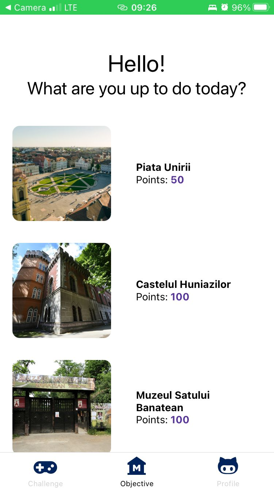
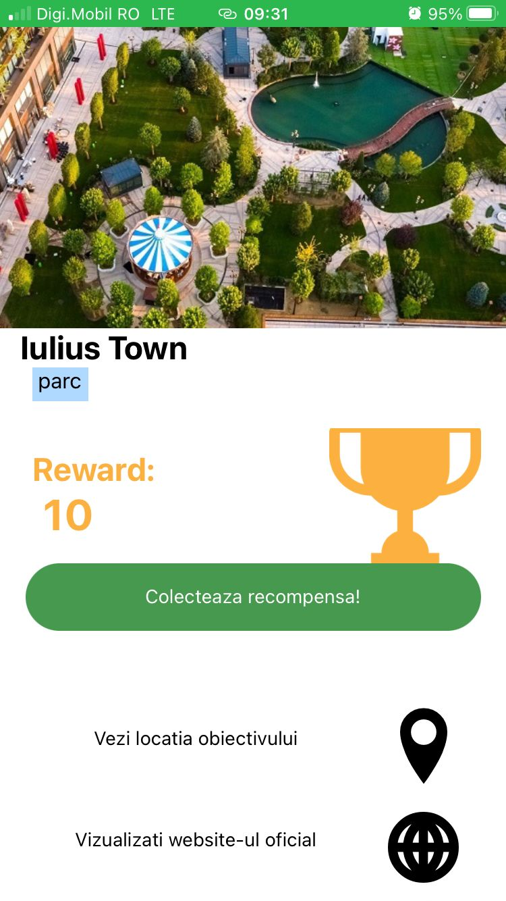
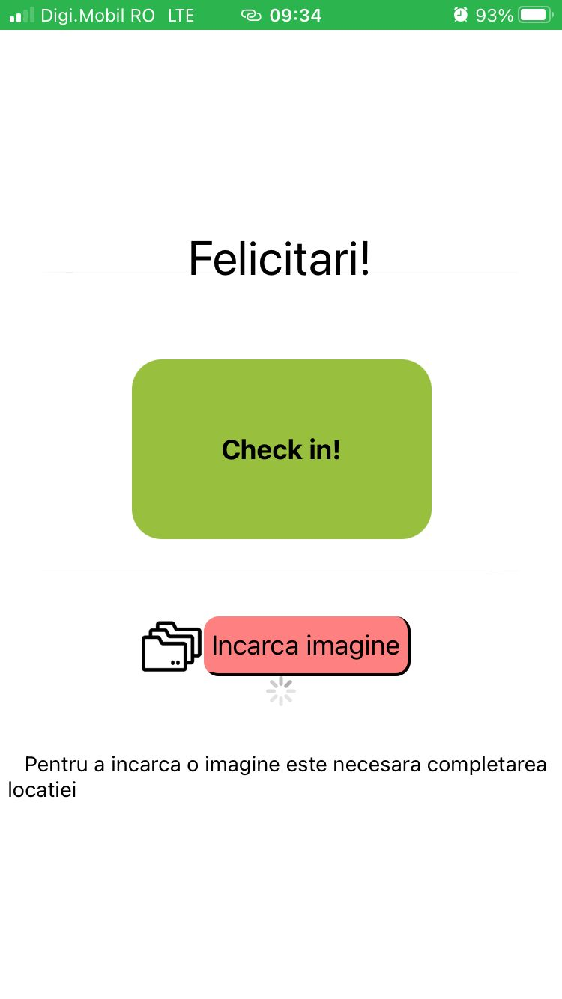
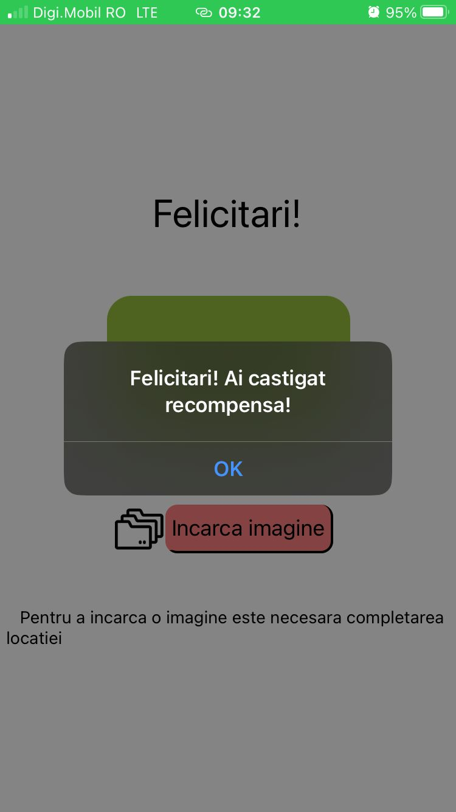
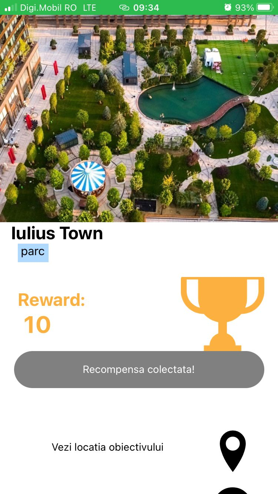
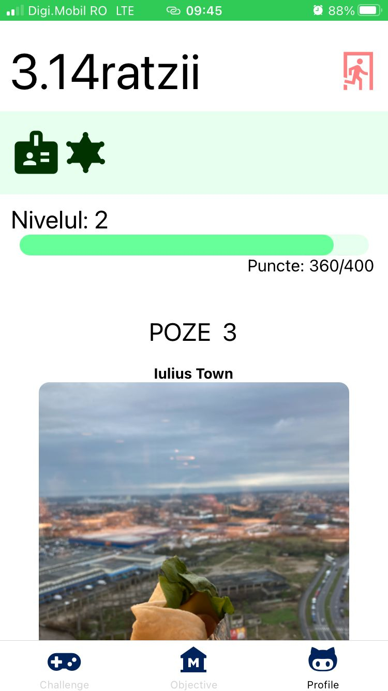

# TimiTourist

TimiTourist este o aplicație care își dorește să introducă o metoda mai intercativă care să motiveze atât turștii cât si localnicii să cunoască Timișoara. Modul prin care  aplicația își propune sa realizeze aceasta este prin imeplemntarea unui sistem de tip joc care îi permite utilizatorului să câștige puncte când vizitează diverse obiective turstice.

## Obiective

  
  

Aceasta este ecranul cu obiective, ecran unde utilizatorul poate selecta un obiectiv turistic, ca mai apoi sa vizualieze detalii sau sa isi culeagă recompensa dacă se află în proximitatea obiectivului.

  
  

Daca obiectivul nu a fost vizitat utilizatorul poate accessa pagina de checkin. Aici se face verificarea proximității, utilizatorul având posibilitatea de a încărca o imagine.
  
Dacă obiectivul a fost vizitat, atunci pagina cu obiectivul va arăta așa:
 

  

## Profil
Acesta este ecranul în care utilizatorul poate vizualiza nivelul la care se află și cât mai are până la completarea acestuia, având acces la pozele pe care le-a făcut pe parcursul vizitelor.
 

  

## Mențiuni

Ecranul de challange-uri este un feature neterminat, urmând ca pe viitor să fie terminat. Ideea este ca utilizatorul să poată accesa un challange ce constă din mai multe obiective turstice grupate, recompensă mai mare și mai multă distracție. :D